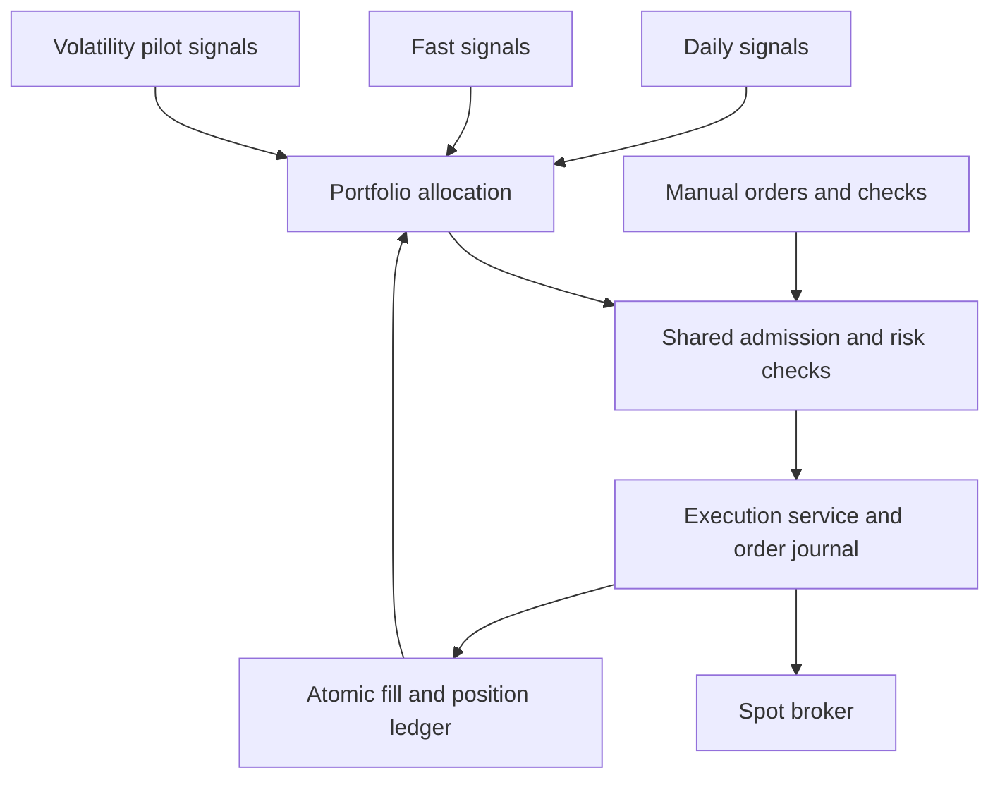

# One account, one trading core

## Decision

Daily and Fast are strategy modules with different horizons, not independent account managers.
They retain separate position attribution and the operator's capital allocations. The common
portfolio and execution services decide how those proposals can affect the same exchange account.
Volatility is an explicitly opted-in, tightly bounded experimental signal module. Think Tank stays research-only. More agents or more live strategies are not, by
themselves, evidence of a better trading system.

This is an incremental consolidation of the existing application. It avoids an unnecessary
microservice rewrite and preserves the tested daily/four-hour signal logic and existing holdings.
It does not claim to be the most profitable or universally optimal architecture.

## Responsibilities

| Module | Responsibility |
|---|---|
| `Engine` | Scheduling, agent/data orchestration, existing public integration methods |
| `StrategyRegistry` | Deployed strategy catalogue, current evidence and decision revision checks |
| `Portfolio` | Shared holdings, capital partition, ownership and remaining acquisition fees |
| `ExecutionService` | Sole broker mutation gateway, one account lock, final permission checks, durable submissions and fill booking |
| `risk` | Cash-only purchase limits, total open positions, loss and instrument checks |
| Daily / Fast | Signal generation and exit decisions at their respective horizons |
| Agents | Data, research, monitoring, bounded existing advice; no additional execution engine |
| Volatility | Fixed-size experimental spot pilot; explicit operator opt-in; shared gateway and ledger |
| Think Tank | Research candidates; no live order route or automatic live promotion |
| Operations API | The same evidence and allocations presented in Cockpit and Handelsplan |

The separation of signals, portfolio construction, risk and execution follows an established
[algorithm framework pattern](https://www.quantconnect.com/docs/v2/writing-algorithms/algorithm-framework/overview).
Our portfolio policy deliberately preserves the chosen allocations rather than allowing competing
strategies to spend the same capital or repeatedly reverse each other's positions.

## Capital and order rules

- Fast retains its fixed allocation plus realized result, or its configured account percentage.
  Uninvested Fast cash is reserved while Fast is enabled. Existing Fast holdings remain committed
  when Fast is disabled; disabling a module does not make those assets available twice.
- Automatic Daily allocation is the remaining account value, with the existing 2% room, capped by
  `live.max_invest`. This setting is the Daily cap, not an additional total-account limit. Manual
  Daily orders keep their configured cap and also respect reserved Fast cash and shared risk limits.
- Every buy, including manual and system-check buys, shares the cash-only gate. Fast manual orders
  also respect Fast's allocation. Daily, Fast and Volatility do not open overlapping ownership of one coin.
- Automatic Daily/Fast buys require enabled strategies and current, non-simulated passing evidence. All
  positive contributors to an active Bank allocation must pass. Evidence, activation and strategy
  revisions are rechecked after network waits. Changed risk/allocation settings invalidate an
  in-flight purchase decision before submission.
- Failed entry evidence blocks purchases, not ordinary strategy exits. Global standby, kill switch
  and unresolved orders block all execution. A kill switch is a stop, not an automatic liquidation.
- Per-order and gross daily-loss purchase limits remain shared across books. A loss limit is a
  purchase stop, not a guaranteed maximum loss. The bot has no borrowing, margin or leverage path.
- Selling existing personal coins to fund Daily purchases still requires the existing
  `use_my_coins` setting. Such sales use the same lock and journal and exclude bot-owned coins.

### Volatility live pilot

- Deploys **disabled**. The authenticated operator must enter `VOLATILITY LIVE` in Research → Volatility →
  Echtgeld-Pilot aktivieren. Global live permission is also required. Deployment and paper results never opt in.
- Fixed initial budget 50 and maximum order notional 30 in account quote currency, plus order fees.
  One open position, at most two BUY submissions per UTC day (including rejections). No automatic scaling.
  Cumulative gross realized losses of 10 permanently stop new pilot buys; gains do not reset this counter.
  This is a purchase stop, not a guaranteed maximum loss. Losses can exceed stop levels during gaps/outages.
- The pilot has no robust backtest certification. Its explicit experimental mandate is separate from Daily/Fast
  evidence. Every buy still passes stance, Guardian, spot-only, fresh liquidity, common account risk and cash gates.
- Two fresh scans after activation supply the baseline and signal. Entry needs range ≥8%, scan momentum ≥2%,
  a breakout above the previous observed high, depth ≥1,000 within 1%, and spread within the operator limit.
  Quote and book are fetched again inside the execution lock; reversal, stale data or oversized minimum skips entry.
- `volatility_qty/volatility_cost` are canonical ownership keys. Confirmed fills use the existing atomic ledger;
  paper positions never migrate. Position age is replayed from real fills; fees keep full ledger precision.
- Shared allocation reserves idle pilot cash, preserves committed capital after a purchase pause, and excludes
  pilot holdings from personal-coin funding. It never sells personal coins to fund its own orders.
- A minute watchdog checks exits at −8%, +20%, or 24h, using fresh prices. Partial exits retain remaining cost
  and entry age. Entry pause and stale scanner data do not disable exits; global standby/kill/uncertainty do.
- Activation/counters survive restart. A currency mismatch blocks orders rather than converting cost bases.
  Confirmed trades appear in Cockpit, positions, journal, notifications and the scoreboard under Volatility.

The existing two-minute scanner is reused; a minute exit watchdog is added. No extra AI model or AI budget
is introduced. Existing trade-notification/coaching behavior still applies when the pilot produces trades.

## Submission, failure and restart

1. Persist a local order with state `submitting` before calling the broker.
2. Submit once. The adapter polls for a final exchange result; no blind submission retry.
3. Validate confirmed quantity, notional and fees. A documented final partial fill is booked as
   the actual partial quantity, not the requested quantity.
4. Commit the trade, position/cost change, Fast attribution and `filled` journal state in one
   synchronous SQLite transaction. Acquisition fees are allocated proportionally on partial exits.
5. A definite rejection is `rejected`; a confirmed adapter no-op is `no_fill`. Transport uncertainty,
   cancellation or a booking failure leaves an unresolved journal entry and stops execution.
6. Startup finds any `submitting` or `uncertain` entries and freezes execution until reconciled.

This is not a distributed exactly-once guarantee: exchange submission and SQLite cannot be one
transaction. The deliberate response to that gap is a durable record and fail-closed reconciliation.
Broker state vocabulary follows [Bitpanda's official CLI documentation](https://docs.fusion.bitpanda.com/commands-370718m0).

### Operator recovery

Keep execution stopped. Back up the persistent database, then compare every unresolved local order
with Fusion's order history, final quantities, fees and balances. The journal stores the exchange
order ID when known, and the local ID, request and timestamps even when the response was lost.
Do not infer a successful fill solely from a balance delta, replay a POST, or clear the kill switch
as a substitute for reconciliation.

Reconcile the trade ledger, attributed quantities/cost and Fast metadata to confirmed exchange
results, without duplicating an already-booked fill. Mark only the reconciled journal entries with
an audited terminal reconciliation state and result. Clear `unresolved_order` only after all pending
entries have been resolved; then deliberately restore the desired global mode and kill-switch state.
There is no automatic recovery bypass or one-click journal deletion in this release.

## Migration and deployment

The `orders` table and indexes are additive. Existing `live_qty/live_cost`, `fast_qty/fast_cost` and
`test_qty/test_cost` keys remain the canonical ownership books; quantities are not copied into a
second position store. Fee replay respects acquisition fees already charged by the previous version.
Existing mode, activation, Bank mode, limits, selected strategies, authentication and AI settings
are preserved. Legacy boot-time overrides of limits and Fast strategy are removed.

Render uses `main`, a persistent `/var/data` database, and manual deploys. The compiled frontend
is committed because the Render build installs Python dependencies only. Deploy the latest tested
commit, then inspect Cockpit status and Research → Handelsplan for actual server readiness. A
deployment neither activates a disabled strategy nor makes an unqualified strategy trade.
No test purchase is needed simply to apply the update.

## Verification and remaining limits

The automated suite uses fake or mocked brokers, including interrupted submissions, atomic rollback,
restart recovery, settings changes during network waits, shared limits, partial fees, concurrent exits,
legacy migration and a static check that only ExecutionService calls broker mutation methods.
Production frontend build and browser checks cover Desktop/Mobile, navigation, preserved Spheres,
no horizontal overflow and no unintended write requests. These checks do not place real orders.

Actual private Render settings and exchange balances require a server-side check. Backtests and
twelve hours of observation cannot establish future profitability. Legacy research and strategy
orchestration still live in the existing process; this release centralizes the consequential execution
and portfolio rules without claiming that every historical module has been rewritten.

## Portfolio observatory

Cockpit now opens with the account chart; the original Sphere remains below it. The new
`GET /api/account/history?period=1d|1w|1m|3m|6m|1y|all` endpoint is authenticated and read-only.
There are no broker calls or trading-setting changes from chart interactions.

- `account_samples` persists one complete account observation every five minutes. Its history
  survives deployment and is not truncated to the legacy 4,000-point window.
- Existing `wallet_hist` is imported once as account values and existing hold-comparison values
  in the configured quote currency. Missing historic per-book P/L and flow data remain NULL.
- Fresh observations include cash, cumulative detected/entered cash flows, and per-book realized
  plus marked open P/L after acquisition fees. Flows have an independent cumulative counter,
  unaffected by truncation of the old 50-event display list. Comparisons use a shared first
  observed baseline; they are changes in quote currency, not annualized returns or TWR.
- Captures during orders, slow reads, missing prices, inconsistent book quantities, simulation
  mode or changed quote currency are skipped. The dashboard exposes the last stored measurement
  and stale/error state. It never fills a gap with a made-up price.
- SQLite aggregates bounded OHLC responses (about 400 bars) even for long histories. Account
  candles describe sampled account balances, not exchange candles or intra-sample price extremes.
  Periods are rolling 24 hours, 7/30/90/180/365 days and the full retained archive.
- The native SVG interface supports account/cash/hold-model curves, flow-adjusted account and
  bot comparisons, line/candles, confirmed trade markers, keyboard crosshair, drag/navigator zoom,
  modal fullscreen, mobile layout, and reduced-motion preferences. Real trading controls remain
  outside the fullscreen chart.

Historical marks missing before this release cannot be reconstructed from trades alone. Short
tracking history remains short even when a user selects three months or a year. Auto-detected
cash flows retain the existing detector's thresholds and may not identify every external event.
